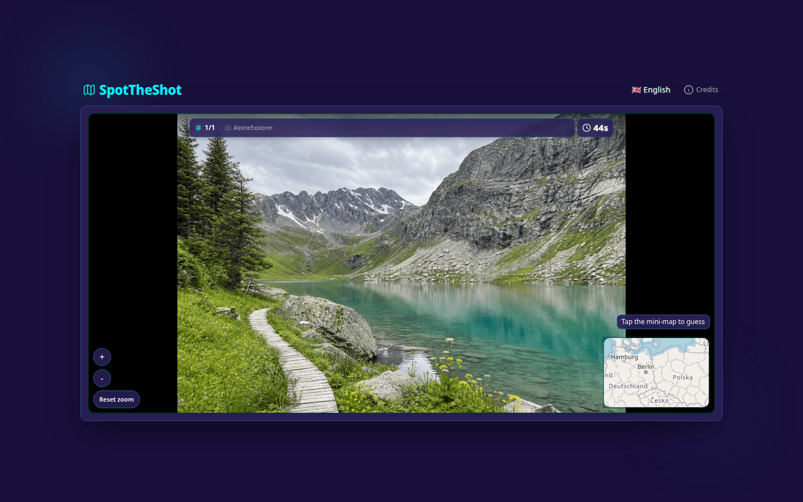
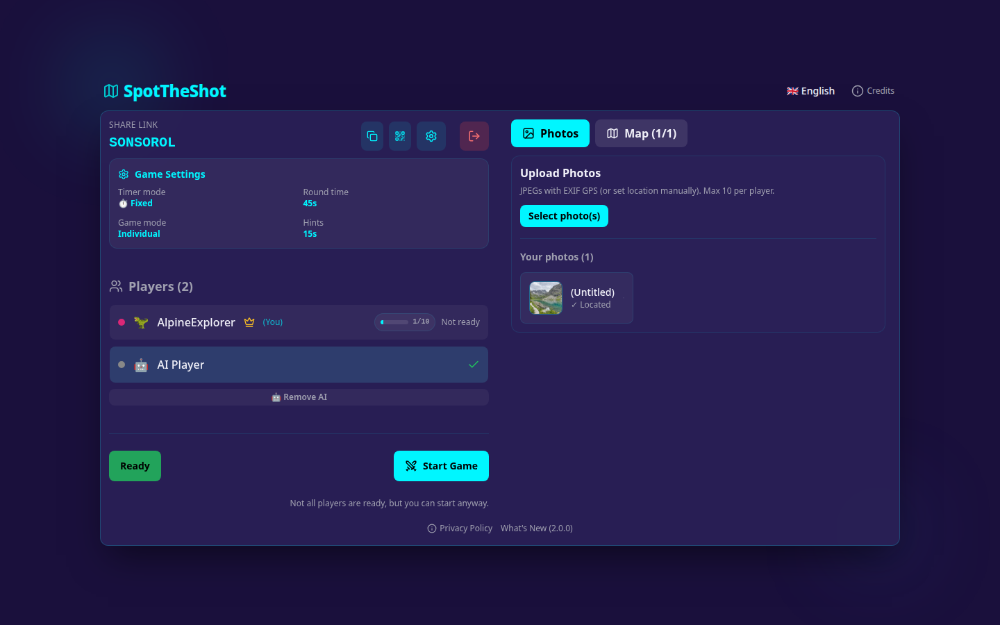
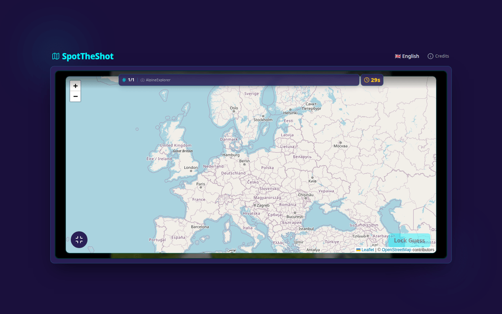
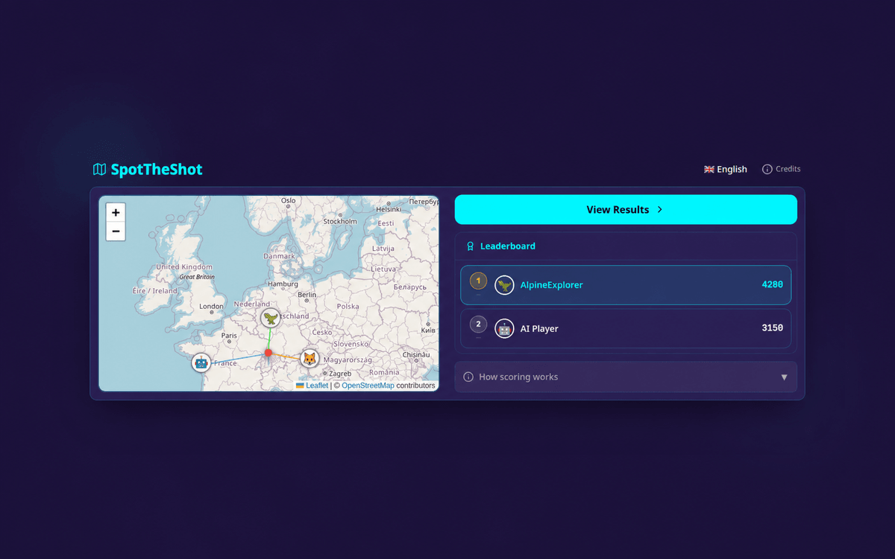
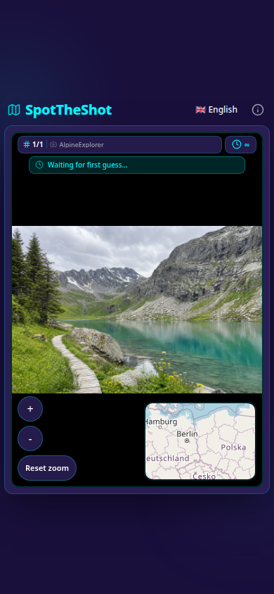

# SpotTheShot — three ways to guess photos

Create a lobby, invite your friends, and let everyone upload a handful of photos. Choose one of three game types:

- **SpotTheShot** (the default): guess on a map where each photo was taken.
- **DateTheShot**: use a draggable timeline to guess when each photo was taken.
- **WhoTookTheShot**: vote for the lobby member who uploaded each photo.

Closer guesses score more points in the location and date games; correct uploader votes score 5,000 points. Every round uses one combined leaderboard that shows each answer, the points earned that round, and the running total. The result view also explains the exact mode formula, uploader penalty, and team contribution rule. Individual/team play and fixed/progressive timers work with every game.

The host chooses the game from a compact dropdown while creating a lobby and can change it later in lobby settings. Existing photos are revalidated on every switch, their uploaders are prompted only for newly required dates or locations, and player readiness is reset. Invitation links expose only the lobby's game type so invitees can see which game they are joining.

Optionally drop in an **on-device "AI" player** that guesses for itself and auto-names everyone's photos with one-line commentary. DateTheShot uses a small constrained vision prompt returning `YYYY-MM-DD`. In WhoTookTheShot, the AI vote is deliberately random and its commentary is explicitly told both the random pick and real uploader. The AI runs entirely on your machine, no API keys, no external services.

**Privacy by design.** Your photos don't leave your server. Server copies live on
disk only for the active game and are deleted when it finishes. For convenient
re-use, each player's browser may retain up to four recent unpinned photos plus
photos they explicitly pin; that local history can be deleted in the photo picker
or by clearing site data.

**Built for modest hardware.** Both AI services are CPU-only and target ~4 GB of RAM at idle.

A self-hosted multiplayer game built around three services: a Node.js + Socket.IO server, a FastAPI image-to-GPS model ([FastGeoCLIP](https://github.com/fbarbe00/FastGeoCLIP)), and a llama.cpp vision LLM for AI commentary and auto-naming.

## See it in action



| Build the lobby together | Place your guess | Compare the results |
|---|---|---|
|  |  |  |

The complete flow is responsive on smaller screens too:

<p align="center">
  
</p>

## Architecture

| Service | Stack | Port | What it does |
|---|---|---|---|
| `client` | React + Vite, nginx | 4080 | Game UI; reverse-proxies API/socket/uploads to `server` |
| `server` | Node.js + Express + Socket.IO | 3001 | Lobby/round state, photo uploads, AI orchestration |
| `geoclip` | FastAPI + PyTorch + FAISS | 8000 | Image → GPS coordinate prediction |
| `vision` | llama.cpp + Ministral-3B-Instruct vision | 8001 | AI commentary, auto-titles for photos, lobby-name generation |

The client's nginx proxies `/api/`, `/uploads/`, and `/socket.io` to `server:3001` over the Docker network. The hostname `server` is hardcoded in `client/nginx.conf`.

## Requirements

- Docker and Docker Compose
- ~6 GB free disk (CLIP vision tower ~1.2 GB, Ministral-3B ~2 GB, GeoCLIP gallery + cache ~400 MB, Docker images ~2 GB)
- ~4 GB RAM at idle. Vision inference is the main bottleneck.
- A multi-core CPU helps both inference services. Both run CPU-only; no GPU required.
- The vision build targets `x86-64-v3` by default.

## Setup

```bash
git clone --recurse-submodules https://github.com/fbarbe00/SpotTheShot.git
cd SpotTheShot
cp .env.example .env
```

Set `ADMIN_TOKEN` in `.env` to a long random secret. The authenticated health,
lobby, model, cleanup, and aggregate-statistics panel is then available at
`/?admin=1`.

### 1. FastGeoCLIP weights and data

The `geoclip/` directory is a submodule pointing at [fbarbe00/FastGeoCLIP](https://github.com/fbarbe00/FastGeoCLIP). The GeoCLIP fine-tuned weights and the 100K-point GPS gallery come bundled with the submodule (in `geoclip/fastgeoclip/`), so the only host-prepared artifacts are the CLIP vision tower and the reverse-geocoding GeoPackage:

```bash
cd geoclip
python reduce_clip_size.py             # downloads CLIP into geoclip/clip/clip-vit-large-vision/
# Optional: drop a GeoPackage at geoclip/data/admin1_clean.gpkg to enable /lookup
# See FastGeoCLIP's README for a wget + convert one-liner.
cd ..
```

Both `geoclip/clip/` and `geoclip/data/` are mounted into the container read-only by `docker-compose.yml`. The first container start spends ~1 minute generating the FAISS index + gallery embeddings, then caches them in the `geoclip_cache` named volume so subsequent starts are fast.

### 2. Vision model

The vision service uses Ministral-3B-Instruct with the `mmproj-F16` multimodal projector. Download it once:

```bash
cd vision
./download-model.sh
cd ..
```

This pulls `Ministral-3-3B-Instruct-2512-IQ4_NL.gguf` + `mmproj-F16.gguf` (~2 GB) into `vision/models/ministral/`. Other supported profiles can be listed with `./download-model.sh --list`; download one by name and set the same name as `MODEL` in `.env` to use it.

### 3. Run

```bash
./run_docker.sh up --build
```

The client lands on http://localhost:4080.

Other entry points (`./run_docker.sh dev`, `prod`, `down`, `restart`, `logs`) wrap the obvious docker-compose commands. `dev` mode enables hot-reload via `docker compose --watch`.

## Configuration

Everything is in `.env`. Key knobs:

| Var | Default | Purpose |
|---|---|---|
| `CLIENT_URL` | `http://localhost:4080` | CORS + Socket.IO origin |
| `ROUND_DURATION_SEC` | 30 | Per-round timer (0 = unlimited for progressive/duel modes) |
| `UPLOAD_LIMIT_MB` | 20 | Max photo upload size |
| `MAX_LOBBIES` | 5 | Server-wide lobby cap |
| `DEFAULT_MAX_PLAYERS` | 20 | Per-lobby player cap (overridable per-token) |
| `GEO_CONCURRENCY` | 2 | Parallel GeoCLIP requests in flight |
| `VISION_CONCURRENCY` | 1 | Parallel vision LLM requests (memory-bound) |
| `MODEL` | `ministral` | Vision profile downloaded by `vision/download-model.sh` |
| `THINKING` | `off` | Reasoning mode for profiles that support it |
| `THREADS` | 4 | Vision generation threads; four leaves capacity for the other services on a 6-core host |
| `THREADS_BATCH` | 5 | Vision prompt/image batch threads; the short batch phase can use one extra core |
| `POLL` | 50 | llama.cpp worker polling; zero reduced vision throughput substantially in testing |
| `NUM_THREADS` | 5 | GeoCLIP CPU thread count (requests remain sequential) |
| `BUILD_JOBS` | 3 | llama.cpp compiler jobs; keep low on a shared server |
| `CTX_SIZE` | 1024 | Vision context; raise only if prompts are truncated |
| `VITE_MAP_BBOX_*` | Europe | Default in-game map bounding box |

Token-based access control lives in `server/data/tokens.json` (gitignored). The defaults in `.env.example` apply to anyone without a token.

### Access tokens

Tokens let you grant specific users expanded capabilities beyond the server defaults (e.g. more players per lobby, higher photo limits, or unlocked AI features).

Create or edit `server/data/tokens.json` (it is mounted as a Docker volume so it persists across restarts):

```json
[
  {
    "id": "a1b2c3d4-e5f6-7890-abcd-ef1234567890",
    "secret": "your-long-random-secret-string-at-least-16-chars",
    "name": "Alice (friend)",
    "expiresAt": null,
    "maxPlayersPerLobby": 50,
    "maxPhotosPerPlayer": 20,
    "allowAllMaps": true,
    "allowAIGuessing": true,
    "allowAutoNaming": true,
    "allowVisionCommentary": true
  }
]
```

**Fields:**

| Field | Type | Description |
|---|---|---|
| `id` | UUID string | Unique identifier — any UUID v4 works |
| `secret` | string (≥16 chars) | The value users paste into the token field in-game |
| `name` | string | Human-readable label shown to the user on token acceptance |
| `expiresAt` | ms epoch or `null` | Expiry timestamp in milliseconds (`Date.now()` style), or `null` for never |
| `maxPlayersPerLobby` | number | Per-lobby player cap for lobbies created with this token |
| `maxPhotosPerPlayer` | number | Per-player photo upload cap |
| `allowAllMaps` | boolean | Unlock all map styles (satellite, watercolor, etc.) |
| `allowAIGuessing` | boolean | Allow adding an AI opponent |
| `allowAutoNaming` | boolean | Allow AI auto-naming of photos |
| `allowVisionCommentary` | boolean | Allow AI vision commentary |

Any omitted field falls back to the server default from `.env`. To generate a secret, use any password generator or run `openssl rand -hex 32` in your terminal. Users enter the secret in the lobby UI under *"Have an access token?"*.

## Development

```bash
cd client && npm install && npm run dev          # client only, against running backend
cd server && npm install && node server.js       # server only, against running model services
./install-hooks.sh                                # installs lint + test pre-commit hook
```

Tests and translation audit:

```bash
cd client
npm run test
npm run check-translations
cd ../server
npm test
```

Player sessions use a private browser-stored credential for reconnects, uploads,
and photo access. Clearing site data signs that browser out of its active lobby;
the player can immediately join again as a new participant.

## DateTheShot details

- Photo dates are read from EXIF metadata when available and can be edited by the uploader in the lobby.
- PNG `Creation Time` metadata and dates embedded in common screenshot filenames are also detected. If no usable date is found, a required date-entry dialog opens after upload.
- Date and GPS metadata are extracted from the selected file before the browser resizes it. On mobile, DateTheShot defaults to the quick photo-library picker, while SpotTheShot defaults to the file browser. Picker behavior varies by mobile OS; if the browser supplies a privacy-sanitized copy without EXIF data, the lobby asks for the missing date or location.
- Every photo needs a valid date before a DateTheShot game can start.
- Dates after the server's current day are rejected on upload, edit, and guess submission.
- At game start, the server derives the timeline from the photo collection: a random 1–3 years before the oldest photo and 1–3 years after the newest, capped at today. Month/year landmarks and precise date controls make long ranges usable.
- The vision model receives a tighter collection-aware range: ten years before the oldest uploaded photo through ten years after the newest, capped at today.
- Date scoring is `round(5000 × e^(-daysAway / 3652.5))`: an exact date earns 5,000 points and the score decreases smoothly with absolute calendar-day error.
- The AI date prompt receives the exact playable start and end dates. When vision commentary is enabled, it compares its submitted date with the real date and jokes about reading the era clues correctly—or getting them wrong.
- DateTheShot uses the vision model directly and does not run GeoCLIP prediction, reverse-geocoding, map, or location-assistance work. Switching back to SpotTheShot prompts uploaders to locate any photos that need coordinates.
- Round results place the real date and every player's labeled icon on one normalized shared timeline. The final view combines all date rounds in one timeline.
- Date-specific achievements reward completing the mode, exact guesses, repeated week- and month-close guesses, sustained play, and accurately dating archival photos. The original First Steps achievement now specifically requires completing a location-guessing game.

## WhoTookTheShot details

- Round payloads replace the real photo ID with a public round token and withhold uploader ownership until results, preventing the answer from being recovered from lobby state.
- Human players vote for any human lobby member. Correct votes score 5,000 points and incorrect votes score 0; the configured uploader penalty is then applied to the uploader's own photo.
- The AI samples uniformly from human players and never invokes GeoCLIP or an identity-recognition prompt.
- Round results reveal every vote. The final view summarizes total votes received, correctly attributed votes, incorrect attributions, and each player's correct guesses.
- Mode-specific achievements reward completing a game, repeated correct identifications, and correct-answer streaks. End-of-game moments cover perfect records, the most-voted player, the strongest detective, and photos that fooled everyone.
- The optional capture-date display can be enabled for this mode without turning the date into required upload metadata.

## Supported languages

English, French, Italian, Spanish, German, Russian. UI strings, achievements, and end-of-game highlights are translated; AI commentary is generated in the lobby's selected language by the vision LLM.

## Tested on

- **OS:** Ubuntu 24.04.4 LTS (Linux 6.8 x86_64)
- **CPU:** AMD EPYC, 6 cores / 6 threads
- **RAM:** 8 GB
- All services run CPU-only; no GPU required.


## License

Source-available, **non-commercial use only**. You are free to run, modify, and share SpotTheShot for personal, educational, or evaluation purposes. Any commercial use — hosting it as a paid service, bundling it into a paid product, or running it on behalf of a revenue-generating organisation — requires written permission from the maintainer first. Open a GitHub issue at <https://github.com/fbarbe00/SpotTheShot> to request it. Full terms in [LICENSE](LICENSE).

The `geoclip/` submodule ([FastGeoCLIP](https://github.com/fbarbe00/FastGeoCLIP)) is MIT-licensed independently and is unaffected by this restriction.
